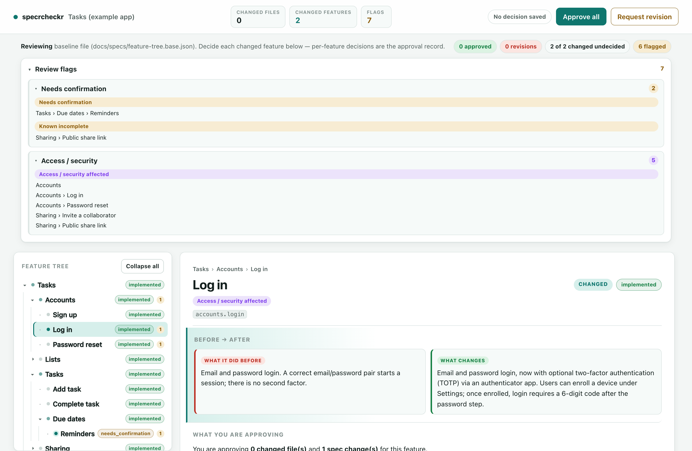

# specrcheckr

**A plain-English approval gate for changes to your software.**

Before a change ships, specrcheckr generates a simple web page that answers, for
every feature your change touches:

1. What did this feature do **before**?
2. What will it do **after** this change?
3. What exactly am I **approving**?
4. What **evidence** backs that up?
5. What **comments or revisions** do I want?

You click Approve or Request revision on each one. That's the gate.

It is built to be **driven by an AI assistant** — you mostly point your AI at
this repo and answer a few questions. A manual setup path exists too
(see [`MANUAL-SETUP.md`](./MANUAL-SETUP.md)).



<sub>The screenshot above is the included synthetic example (`npm run example`) — no real product data.</sub>

---

## 🟢 Start here — point your AI at this repo

If you use an AI coding assistant (Claude Code, Cursor, or similar) **inside your
own project**, paste this to it:

```
Read AGENTS.md from https://github.com/Relevant-Use/specrcheckr and set up
specrcheckr in this repository for me. Interview me one question at a time,
draft my feature tree from my codebase, wire everything up, run it, then show
me how to use it. Don't change my application code.
```

That's the whole setup experience for you: answer a few plain questions, glance
at the draft it produces, and you're done. Everything below explains what's
actually happening so you're never in the dark.

---

## What it does (in plain English)

Most "review" tools show you a wall of changed code. Useless if you're not the
person who wrote it. specrcheckr flips that around: it shows you **what product
behavior is changing, in normal sentences**, organized as a tree of your
features. The raw code and technical details are still there — tucked away under
"Evidence" — but they're not what you read first.

You end up with a focused checklist of "here's what's changing and why; approve
or push back on each one."

## How it does it (in plain English)

specrcheckr needs **one thing** from your project: a **feature tree** — a simple
file that lists what your product does, in plain language, with each feature
pointing at the code files that implement it.

- When you (or your AI) change code, specrcheckr compares the current state to a
  baseline and figures out **which features were touched**.
- It reads the plain-English description you wrote for each touched feature and
  shows a short **before / after**.
- It flags anything that needs a human's attention — security-sensitive areas,
  unfinished features, changes with no description yet — and **groups those flags
  by how urgent they are**.
- You approve or request changes per feature. Your decisions are saved to a small
  file your tools (or your AI) can read.

The "intelligence" lives in that feature tree, which **you maintain** (with your
AI's help). specrcheckr is the lens that makes it reviewable — it does not invent
explanations from your code. If it can't describe a change, it says
**"Needs human summary"** rather than guessing.

---

## 🤖 What you're having the AI do on your behalf (plain English)

When you run the kickoff prompt above, here is **everything** the AI does for you.
None of it touches your running application — it only adds review tooling.

1. **Checks your setup.** Confirms you have Node.js and that you're inside a
   git project. If not, it tells you in plain terms what to install.
2. **Copies in the tool.** Adds specrcheckr's small set of script files and one
   config file to your project. (No libraries to install — it has zero
   dependencies.)
3. **Interviews you.** Asks a handful of plain questions — "What are the main
   things your product does?", "Who can do what?" — *one at a time*.
4. **Reads your codebase and drafts your feature tree.** Combines your answers
   with what it finds in your code to write the first version of your feature
   list, and connects each feature to the files that implement it. **This is a
   draft you review — not gospel.** It will be imperfect; you correct it.
5. **Wires it up.** Adds the short commands (and, if you want, a pre-push or CI
   check) so the gate runs at the right moment.
6. **Runs it and shows you.** Generates the review page, opens it, and walks you
   through reading and approving.
7. **Stays in its lane.** It will **ask before** doing anything outside the
   tool's own files — it won't edit your app code, your CI, or anything risky
   without your OK, and everything it does is reversible.

You are **not** handing over the keys. You're having it do the typing, the
code-reading, and the wiring — and you confirm the result.

---

## 🔧 The ongoing processes you set up (this is the part people forget)

specrcheckr only stays useful if the feature tree stays honest. That's a small,
ongoing habit — here's the whole maintenance model, and the AI sets these up so
they mostly run themselves.

### 1. "Spec-first" change habit
When you change real behavior, the feature tree gets updated **in the same
change** — ideally *before* the code. In practice your AI does this for you:
update the feature's description, then write the code. specrcheckr's whole
value depends on this one habit.

### 2. The review step (the gate)
Before a change ships, you run the review (`specrcheckr serve`), open the page,
and approve each touched feature. Your AI will prompt you to do this; you can
also just ask it: *"run the specrcheckr review and give me the link."*

### 3. The automated gate (optional but recommended)
The AI can wire `specrcheckr check` into a **pre-push hook** or your **CI**, so a
change literally cannot ship until the review is saved and approved. This is what
turns the habit into a guarantee instead of a good intention.

### 4. Keeping the tree trustworthy
Two cheap safety nets, both run by the AI or your CI:
- `specrcheckr validate` — makes sure the feature tree is well-formed (no broken
  or duplicated entries).
- A periodic *"does the tree still match reality?"* pass — every so often, ask
  your AI: *"review my feature tree against the current codebase and flag
  anything stale."* Drift is the main way a tool like this rots; this catches it.

### 5. Who owns it
Pick one person (or "whoever's shipping") to be responsible for approving
reviews. The tool records decisions, but a person still decides.

> **The honest caveat:** specrcheckr asks you to keep a feature tree current.
> That's real, if small, ongoing work. The payoff is that every change comes with
> a readable, approvable summary instead of a diff you have to decode. If you
> won't maintain the tree, this tool won't help you — be honest with yourself
> about that before adopting it.

---

## 📋 Prompts you'll reuse

Copy/paste these to your AI whenever you need them. You never have to learn the
commands.

- **Set it up:** *"Read AGENTS.md from the specrcheckr repo and set it up here."*
- **Add a feature:** *"Add a feature to my specrcheckr tree: [describe it]."*
- **I changed something:** *"I changed [X]. Update the specrcheckr feature tree to
  match, then run the review and give me the link."*
- **Review my current changes:** *"Run the specrcheckr review for my current
  changes and summarize what I'm approving."*
- **Health check:** *"Validate my specrcheckr tree and check it against the
  codebase for anything stale."*

---

## ⌨️ The commands (if you ever want them directly)

specrcheckr is zero-dependency — just Node.js 18+.

### Install

```bash
# from npm (recommended once published)
npm install -D specrcheckr
npx specrcheckr init

# or with no install at all
npx specrcheckr@latest init
```

Prefer not to use npm? Vendor it instead: copy this repo's `bin/`, `scripts/`,
and `schemas/` folders into your project and run
`node path/to/bin/specrcheckr.mjs <command>`.

### Commands

| Command | What it does |
|---|---|
| `specrcheckr init` | Scaffold a config + starter feature tree |
| `specrcheckr review` | Generate the review page |
| `specrcheckr serve` | Generate + serve it, and save your decisions |
| `specrcheckr check` | Pass/fail gate (for pre-push or CI) |
| `specrcheckr validate` | Check the feature tree is well-formed |
| `specrcheckr scan` | Fail if banned terms leak into the repo |

See [`MANUAL-SETUP.md`](./MANUAL-SETUP.md) for the by-hand path and the feature
tree format. The schema lives in [`schemas/feature-tree.schema.json`](./schemas/feature-tree.schema.json).

## 👀 Try the example

```
git clone https://github.com/Relevant-Use/specrcheckr
cd specrcheckr
npm run example          # generates examples/todo-app/.spec-review/index.html
npm run example:serve    # ...and serves it so you can click around
```

The example is a synthetic to-do app — there is no real product data in this
repo.

## License

Apache-2.0 © Relevant Use LLC. See [`LICENSE`](./LICENSE) and [`NOTICE`](./NOTICE).
